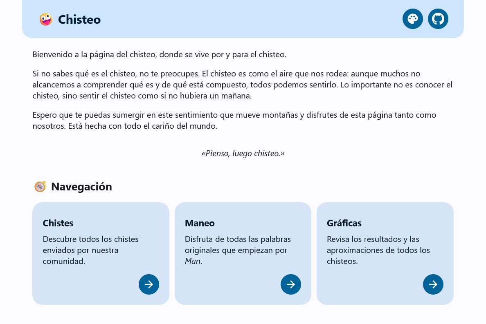

# Chisteo

El chisteo es una página web para ver y publicar chistes.
Los principales contenidos son los siguientes.

- 🤣 **Chistes**: una colección con todos los chistes de la página por autor.
- 🐎 **Maneo**: una colección con todas las palabras que empiezan por *Man*.
- 📈 **Gráficas**: una representación de los resultados y aproximaciones de los chisteos.
- 🏆 **Ranking**: una gráfica con las personas que más chistes han enviado.
- ✒️ **Formulario**: una sección para enviar chistes o palabras con *Man*.

El diseño está inspirado [Material Design](https://m3.material.io/), el lenguaje de diseño utilizado por Google en Android.
Además, se hace uso de [Material Color Utilities](https://github.com/material-foundation/material-color-utilities) para generar un tema a partir de cualquier color.

